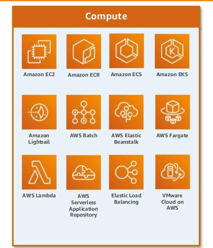

# Cloud samenvatting
## opfrissing cloud concepten

AWS bestaat uit 4 lagen,

1. __Infrastructure__

De onderste laag biedt de fysieke en virtuele basis voor alle andere diensten. Dit omvat:

    Regions: Geografische gebieden waar AWS-datacenters zich bevinden (bijvoorbeeld Europa, Noord-Amerika).
    Voorbeeld: Als je een applicatie in Europa wilt hosten voor een lagere latentie bij Europese gebruikers, kies je een regio zoals Frankfurt.
    Availability Zones: Subsets binnen een regio met meerdere datacenters voor hoge beschikbaarheid.
    Voorbeeld: Je kunt je database in meerdere zones repliceren, zodat een storing in één zone geen impact heeft.
    Edge locations: Locaties dicht bij gebruikers om content sneller te leveren via een CDN zoals Amazon CloudFront.
    Voorbeeld: Video's streamen via CloudFront levert snellere prestaties voor gebruikers wereldwijd.

2. __Foundation Services__

Deze laag biedt fundamentele bouwstenen zoals rekenkracht, opslag en netwerken:

    Compute: Diensten zoals Amazon EC2 en Lambda voor het uitvoeren van code of applicaties.
    Voorbeeld: Gebruik EC2-instanties om een website te hosten.
    Networking: Verbindingen tussen diensten en gebruikers, inclusief VPC's en load balancers.
    Voorbeeld: Met een Load Balancer kun je verkeer verdelen tussen meerdere servers.
    Storage: Diensten zoals S3, EBS en Glacier voor object-, blok- en archiefopslag.
    Voorbeeld: Sla afbeeldingen of backups op in S3.

3. __Platform Services__

Biedt meer geavanceerde diensten zoals databases, analytics en DevOps-tools:

    Databases: Relational (RDS), NoSQL (DynamoDB), of caching (ElastiCache).
    Voorbeeld: Gebruik DynamoDB om gebruikersgegevens in een mobiele app op te slaan.
    Analytics: Data-analyse zoals Amazon Redshift of EMR.
    Voorbeeld: Analyseer websitegebruikers met Redshift.
    Deployment and management: Tools voor containers, monitoring en infrastructuurbeheer, zoals CloudFormation of EKS.
    Voorbeeld: Automatiseer de implementatie van je infrastructuur met CloudFormation.

4. __Applications__

Deze bovenste laag biedt eindgebruikersgerichte diensten zoals virtuele desktops, samenwerking en mobiele diensten:

    Mobile Services: Tools zoals AWS Cognito voor identiteitsbeheer in mobiele apps.
    Voorbeeld: Voeg loginfunctionaliteit toe aan je app met Cognito.
    Collaboration: Tools zoals WorkSpaces voor samenwerking en virtuele werkplekken.
    Voorbeeld: Stel werknemers in staat op afstand te werken via virtuele desktops.

### Foundation services
#### 1. compute

bevat alle __compute__ services zoals __EC2__ ,__ECR__ , __ECS__ en __EKS__
##### common used services and their use cases
...
#### 2. storage

bevate alle __storage__ services zoals __S3__, __EBS__ en __Glacier__
#### 3. network

#### 4. security

