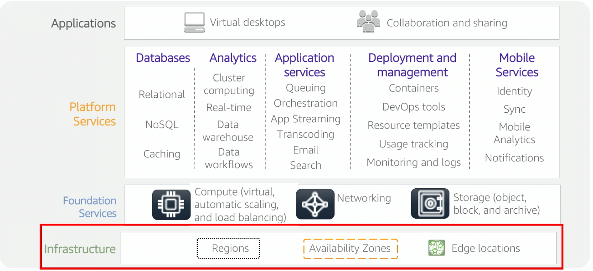
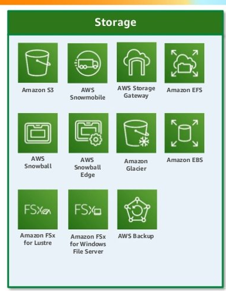
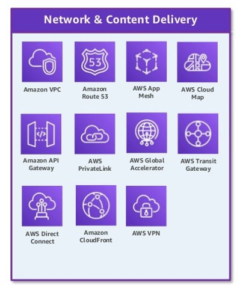
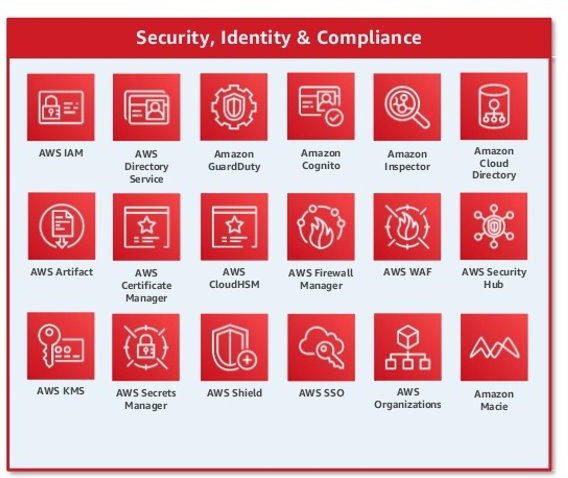

# Cloud samenvatting
<!-- vscode-markdown-toc -->
* 1. [Opfrissing cloud concepten](#Opfrissingcloudconcepten)
	* 1.1. [AWS layers](#AWSlayers)
	* 1.2. [Foundation services](#Foundationservices)
		* 1.2.1. [1. Compute](#Compute)
		* 1.2.2. [1.1 Common used compute services and their use cases](#Commonusedcomputeservicesandtheirusecases)
		* 1.2.3. [2. Storage](#Storage)
		* 1.2.4. [2.1 Common used storage services and their use cases](#Commonusedstorageservicesandtheirusecases)
		* 1.2.5. [3. Network](#Network)
		* 1.2.6. [3.1 Common used network services and their use cases](#Commonusednetworkservicesandtheirusecases)
		* 1.2.7. [4. Security](#Security)
		* 1.2.8. [4.1 Common used security services and their use cases](#Commonusedsecurityservicesandtheirusecases)
	* 1.3. [Platform services](#Platformservices)
		* 1.3.1. [1. Regions](#Regions)
		* 1.3.2. [2. Availability Zones (AZs)](#AvailabilityZonesAZs)
		* 1.3.3. [3. Edge Locations](#EdgeLocations)
* 2. [System tools](#Systemtools)
		* 2.1. [1. Maintenance Windows](#MaintenanceWindows)
		* 2.2. [2. Compliance](#Compliance)
		* 2.3. [3. Fleet Manager](#FleetManager)
		* 2.4. [4. Incident Manager](#IncidentManager)
		* 2.5. [5. State Manager](#StateManager)
	* 2.1. [AWS Systems Manager Service](#AWSSystemsManagerService)
		* 2.1.1. [Advanced Features van AWS Session Manager](#AdvancedFeaturesvanAWSSessionManager)
	* 2.2. [AWS OpsCenter](#AWSOpsCenter)
		* 2.2.1. [Key Features van AWS Parameter Store](#KeyFeaturesvanAWSParameterStore)
		* 2.2.2. [AWS Automation Runbook](#AWSAutomationRunbook)
	* 2.3. [AWS Automation Runbook binnen het IaC Landschap](#AWSAutomationRunbookbinnenhetIaCLandschap)
* 3. [Finops tools](#Finopstools)
	* 3.1. [Algemene Concepten in FinOps](#AlgemeneConcepteninFinOps)
		* 3.1.1. [1. FinOps](#FinOps)
		* 3.1.2. [2. AWS Budgets](#AWSBudgets)
		* 3.1.3. [3. Spot Instances](#SpotInstances)
		* 3.1.4. [4. Reserved Instances](#ReservedInstances)
	* 3.2. [3 Eigenschappen van Cloud FinOps](#EigenschappenvanCloudFinOps)
	* 3.3. [4 Elementen van de FinOps Tooling Stack](#ElementenvandeFinOpsToolingStack)
	* 3.4. [6 FinOps Domains & Capabilities](#FinOpsDomainsCapabilities)
	* 3.5. [6 FinOps Principles](#FinOpsPrinciples)
	* 3.6. [AWS Billing Dashboard](#AWSBillingDashboard)
	* 3.7. [EC2 Instances voor FinOps](#EC2InstancesvoorFinOps)
	* 3.8. [4 Strategieën voor Kostenreductie](#StrategienvoorKostenreductie)
	* 3.9. [AWS Trusted Advisor](#AWSTrustedAdvisor)
* 4. [DevOps tools in de cloud](#DevOpstoolsindecloud)
	* 4.1. [__Concepten in Continuous Integration (CI) en Continuous Delivery (CD)__](#ConcepteninContinuousIntegrationCIenContinuousDeliveryCD__)
	* 4.2. [__DevOps Culture__](#DevOpsCulture__)
	* 4.3. [Verschillende DevOps Practices](#VerschillendeDevOpsPractices)
	* 4.4. [__Voordelen van DevOps volgens AWS__](#VoordelenvanDevOpsvolgensAWS__)
	* 4.5. [__5 Fasen van Release en Monitor__](#FasenvanReleaseenMonitor__)
	* 4.6. [__Vergelijking van AWS CodeBuild en Jenkins__](#VergelijkingvanAWSCodeBuildenJenkins__)
* 5. [Container service in de cloud](#Containerserviceindecloud)
	* 5.1. [Concepten binnen AWS Containers: ECR, Fargate, ECS, EKS](#ConceptenbinnenAWSContainers:ECRFargateECSEKS)
	* 5.2. [ECS (Elastic Container Service)](#ECSElasticContainerService)
		* 5.2.1. [Componenten van ECS](#ComponentenvanECS)
	* 5.3. [Verschillen tussen ECS en EKS](#VerschillentussenECSenEKS)
		* 5.3.1. [__Criteria voor het kiezen tussen Fargate, EKS en ECS__](#CriteriavoorhetkiezentussenFargateEKSenECS__)
		* 5.3.2. [__Revisions en Versioning binnen ECS Deployments__](#RevisionsenVersioningbinnenECSDeployments__)
		* 5.3.3. [__Verschil met EKS/Kubernetes__](#VerschilmetEKSKubernetes__)
* 6. [Observability in the cloud](#Observabilityinthecloud)
	* 6.1. [Concepten rond observability](#Conceptenrondobservability)
* 7. [Implementatie van Observability (volgens AWS)](#ImplementatievanObservabilityvolgensAWS)
	* 7.1. [6 Elementen voor Modern Application Development](#ElementenvoorModernApplicationDevelopment)
	* 7.2. [Proactieve- en Reactieve Operations](#Proactieve-enReactieveOperations)
	* 7.3. [Niveaus van Observability](#NiveausvanObservability)
	* 7.4. [Pijlers van Observability](#PijlersvanObservability)
	* 7.5. [Voordelen van Application Observability](#VoordelenvanApplicationObservability)
* 8. [Cloudformation en Automation](#CloudformationenAutomation)
	* 8.1. [Voordelen van Configuration Management](#VoordelenvanConfigurationManagement)
	* 8.2. [Automatische Configuratie van EC2-instanties](#AutomatischeConfiguratievanEC2-instanties)
	* 8.3. [Voor- en Nadelen van een Standalone Configuration Server](#Voor-enNadelenvaneenStandaloneConfigurationServer)
	* 8.4. [Infrastructuur Resource Lifecycle](#InfrastructuurResourceLifecycle)
	* 8.5. [Cloud Deployment Challenges](#CloudDeploymentChallenges)
	* 8.6. [Technologieën voor Geautomatiseerde Deployments binnen AWS](#TechnologienvoorGeautomatiseerdeDeploymentsbinnenAWS)
	* 8.7. [CloudFormation in het IaC Landschap](#CloudFormationinhetIaCLandschap)
	* 8.8. [CloudFormation Template Structuur](#CloudFormationTemplateStructuur)
	* 8.9. [cfn-signal, WaitCondition en WaitConditionHandle](#cfn-signalWaitConditionenWaitConditionHandle)

<!-- vscode-markdown-toc-config
	numbering=true
	autoSave=true
	/vscode-markdown-toc-config -->
<!-- /vscode-markdown-toc -->

##  1. Opfrissing cloud concepten

###  1.1. AWS layers
AWS bestaat uit 4 lagen,

1. __Infrastructure__

De onderste laag biedt de fysieke en virtuele basis voor alle andere diensten. Dit omvat:

    Regions: Geografische gebieden waar AWS-datacenters zich bevinden (bijvoorbeeld Europa, Noord-Amerika).
    Voorbeeld: Als je een applicatie in Europa wilt hosten voor een lagere latentie bij Europese gebruikers, kies je een regio zoals Frankfurt.
    Availability Zones: Subsets binnen een regio met meerdere datacenters voor hoge beschikbaarheid.
    Voorbeeld: Je kunt je database in meerdere zones repliceren, zodat een storing in één zone geen impact heeft.
    Edge locations: Locaties dicht bij gebruikers om content sneller te leveren via een CDN zoals Amazon CloudFront.
    Voorbeeld: Video's streamen via CloudFront levert snellere prestaties voor gebruikers wereldwijd.

2. __Foundation Services__

Deze laag biedt fundamentele bouwstenen zoals rekenkracht, opslag en netwerken:

    Compute: Diensten zoals Amazon EC2 en Lambda voor het uitvoeren van code of applicaties.
    Voorbeeld: Gebruik EC2-instanties om een website te hosten.
    Networking: Verbindingen tussen diensten en gebruikers, inclusief VPC's en load balancers.
    Voorbeeld: Met een Load Balancer kun je verkeer verdelen tussen meerdere servers.
    Storage: Diensten zoals S3, EBS en Glacier voor object-, blok- en archiefopslag.
    Voorbeeld: Sla afbeeldingen of backups op in S3.

3. __Platform Services__

Biedt meer geavanceerde diensten zoals databases, analytics en DevOps-tools:

    Databases: Relational (RDS), NoSQL (DynamoDB), of caching (ElastiCache).
    Voorbeeld: Gebruik DynamoDB om gebruikersgegevens in een mobiele app op te slaan.
    Analytics: Data-analyse zoals Amazon Redshift of EMR.
    Voorbeeld: Analyseer websitegebruikers met Redshift.
    Deployment and management: Tools voor containers, monitoring en infrastructuurbeheer, zoals CloudFormation of EKS.
    Voorbeeld: Automatiseer de implementatie van je infrastructuur met CloudFormation.

4. __Applications__

Deze bovenste laag biedt eindgebruikersgerichte diensten zoals virtuele desktops, samenwerking en mobiele diensten:

    Mobile Services: Tools zoals AWS Cognito voor identiteitsbeheer in mobiele apps.
    Voorbeeld: Voeg loginfunctionaliteit toe aan je app met Cognito.
    Collaboration: Tools zoals WorkSpaces voor samenwerking en virtuele werkplekken.
    Voorbeeld: Stel werknemers in staat op afstand te werken via virtuele desktops.
###  1.2. Foundation services

####  1.2.1. 1. Compute

####  1.2.2. 1.1 Common used compute services and their use cases
1. __Amazon EC2 (Elastic Compute Cloud)__

A service that provides resizable virtual servers (instances) in the cloud.
__Use Cases__:

    Hosting websites and applications.
    Running custom software that requires specific operating systems or configurations.
    Batch processing workloads.
    Running legacy applications that can’t easily be containerized or serverless.

2. __AWS Lambda__

A serverless compute service that runs your code in response to events.
__Use Cases__:

    Building microservices or APIs.
    Running short-lived, event-driven functions (e.g., processing S3 uploads, triggering actions from database changes).
    Automating infrastructure tasks like resizing images or monitoring logs.
    Real-time data processing, such as streaming data from IoT devices.

3. __Amazon ECS (Elastic Container Service)__

A container orchestration service to deploy and manage containerized applications.
__Use Cases__:

    Running Docker containers for microservices-based architectures.
    Orchestrating containerized batch jobs.
    Hosting scalable APIs or backend services.

4. __Amazon EKS (Elastic Kubernetes Service)__

A managed Kubernetes service to run Kubernetes clusters without managing the control plane.
__Use Cases__:

    Running containerized workloads using Kubernetes-native tools.
    Migrating on-premises Kubernetes workloads to AWS.
    Managing multi-cloud or hybrid Kubernetes clusters.

####  1.2.3. 2. Storage

####  1.2.4. 2.1 Common used storage services and their use cases
Here are the top 4 commonly used AWS Storage Services and their use cases:
1. __Amazon S3 (Simple Storage Service)__

A highly scalable, durable, and cost-effective object storage service.

__Use Cases__:

    Data backups and archiving: Storing backups or compliance-related data.
    Static website hosting: Hosting static files like HTML, CSS, and images.
    Big data storage: Storing raw data for analytics, such as logs or IoT device data.
    Media storage: Storing large media files like videos, images, or audio.

2. __Amazon EBS (Elastic Block Store)__

Block storage for use with Amazon EC2 instances, designed for low-latency workloads.

__Use Cases__:

    Database storage: Running high-performance relational or NoSQL databases like MySQL or MongoDB.
    Transactional workloads: Supporting applications that require low-latency, high-throughput access.
    Boot volumes: Hosting the root file system of an EC2 instance.

3. __Amazon EFS (Elastic File System)__

A fully managed, scalable file storage for use with AWS compute services.

__Use Cases__:

    Shared storage: Providing a shared file system for multiple EC2 instances or containers.
    Content management systems: Hosting shared content like media assets or configuration files.
    Big data and analytics: Storing large datasets accessible by multiple processing nodes.

4. __Amazon Glacier (S3 Glacier)__

A low-cost storage service for archiving and long-term data storage.

__Use Cases__:

    Cold storage: Archiving infrequently accessed data such as compliance records or legal documents.
    Disaster recovery: Storing backups for recovery in the event of data loss.
    Data retention: Retaining data for regulatory or historical purposes at a low cost.

####  1.2.5. 3. Network

####  1.2.6. 3.1 Common used network services and their use cases

1. __Amazon VPC (Virtual Private Cloud)__

A service that lets you create a logically isolated network environment in AWS.

__Use Cases__:

    Isolating workloads: Running sensitive applications in a private network.
    Hybrid cloud environments: Connecting on-premises networks to AWS using VPN or Direct Connect.
    Custom networking: Defining custom subnets, routing tables, and security groups.

2. __Amazon CloudFront__

A content delivery network (CDN) that caches data at edge locations for faster delivery.

__Use Cases__:

    Content delivery: Serving static and dynamic content like websites, videos, or APIs.
    Global reach: Improving performance for users in different regions.
    DDoS protection: Enhancing security through integration with AWS Shield.

3. __Elastic Load Balancing (ELB)__

Automatically distributes incoming traffic across multiple targets (e.g., EC2 instances, containers).

__Use Cases__:

    High availability: Ensuring application reliability by routing traffic to healthy instances.
    Scaling applications: Distributing traffic as instances scale up or down.
    Multi-AZ deployments: Balancing traffic across multiple availability zones for fault tolerance.

4. Amazon Route 53__

A scalable DNS and domain name management service.

__Use Cases__:

    Domain management: Registering and managing domains directly through AWS.
    Routing traffic: Directing traffic to endpoints (e.g., EC2 instances, S3 buckets) based on routing policies like geolocation or latency.
    Failover: Automatically redirecting traffic during outages to backup servers.
####  1.2.7. 4. Security

####  1.2.8. 4.1 Common used security services and their use cases

1. __AWS Identity and Access Management (IAM)__

A service that controls access to AWS resources using users, roles, and policies.

__Use Cases__:

    User authentication and authorization: Managing who can access specific AWS resources.
    Granular permissions: Enforcing least privilege access for different teams or services.
    Service-to-service access: Allowing secure interactions between AWS services using roles.

2. __AWS Key Management Service (KMS)__

A managed service for creating and controlling encryption keys.

__Use Cases__:

    Data encryption: Encrypting data in S3, EBS, or RDS.
    Application-level encryption: Securing sensitive data like API keys or user credentials.
    Compliance: Meeting regulatory requirements by managing cryptographic keys securely.

3. __AWS CloudTrail__

A service that provides governance, compliance, and operational audit logs of AWS account activities.

__Use Cases__:

    Audit logging: Tracking changes to resources and identifying unauthorized access.
    Security analysis: Monitoring and investigating suspicious activities.
    Compliance reporting: Proving adherence to regulations by providing an activity history.
###  1.3. Platform services
####  1.3.1. 1. Regions

Een "Region" is een geografische locatie waar AWS datacenters (Availability Zones) zijn gevestigd. Elke regio bestaat uit meerdere zones om hoge beschikbaarheid en fouttolerantie te garanderen.

In eigen woorden: Dit is de fysieke plek waar je applicaties en data worden gehost. Je kiest een regio dicht bij je gebruikers om de prestaties te verbeteren.

Bij het kiezen van een regio moet je wel op onderstaande letten:
- __data goverance/legaliteit__
- __latency__
- __beschikbare services in de region__
- __costs__

__Voorbeeld__:

    Amazon EU (Frankfurt) Region: Een Europese e-commercewebsite gebruikt de Frankfurt-regio om lage latentie te bieden aan klanten in Europa.

__Use case:__ Het kiezen van een regio dicht bij klanten om snellere responstijden te realiseren.

####  1.3.2. 2. Availability Zones (AZs)

Een regio bevat meerdere AZ's, die bestaan uit afzonderlijke datacenters met eigen stroom, koeling en netwerk. Ze zijn ontworpen om onafhankelijk te zijn, maar ook om met elkaar te communiceren via snelle verbindingen.

In eigen woorden: Een AZ is een cluster van datacenters in een regio. Het gebruik van meerdere AZ's zorgt ervoor dat je applicatie online blijft, zelfs als een van de zones faalt.

__Voorbeeld__:

    Een applicatie die gebruikmaakt van meerdere AZ's in de US East (N. Virginia) Region om downtime te voorkomen.
__Use case:__ Het draaien van een database in twee AZ's met automatische failover voor hoge beschikbaarheid.

####  1.3.3. 3. Edge Locations

Edge-locaties zijn datacenters die zich dicht bij eindgebruikers bevinden en worden gebruikt door AWS-diensten zoals Amazon CloudFront. Ze verbeteren de prestaties van applicaties door content dichter bij de gebruiker te brengen.

In eigen woorden: Dit zijn datacenters verspreid over de hele wereld die zorgen voor snelle levering van content zoals websites, video's en API's.

__Voorbeeld__:

    Een streamingplatform maakt gebruik van een edge-locatie in Tokyo om video's met lage latency te leveren aan kijkers in Japan.

__Use case:__ Een internationaal bedrijf gebruikt edge-locaties om een wereldwijd publiek snel toegang te bieden tot statische en dynamische content.
##  2. System tools

AWS Systems Manager is een krachtige service voor het beheren van de infrastructuur van AWS-cloudomgevingen. Het biedt een breed scala aan tools voor het beheren, bewaken en automatiseren van IT-operaties. Hieronder worden verschillende concepten en gerelateerde services binnen AWS Systems Manager besproken.
Algemeen Concepten van AWS Systems Manager

####  2.1. 1. Maintenance Windows

Dit is een geplande tijdsperiode waarin systeemonderhoud kan plaatsvinden zonder dat het invloed heeft op de gebruikerservaring of de werking van de service.
Voorbeeld:

    Een organisatie plant onderhoud voor haar servers in een Maintenance Window van 00:00 tot 04:00, zodat er minimale impact is op de productieomgeving.

####  2.2. 2. Compliance

Compliance in AWS Systems Manager houdt in dat je ervoor zorgt dat je infrastructuur voldoet aan de specifieke standaarden en beleidsregels die van toepassing zijn op je omgeving.
Voorbeeld: 

    Het automatisch controleren of alle instances voldoen aan de beveiligingsrichtlijnen, zoals het gebruik van versleutelde volumes en het uitvoeren van beveiligingspatches.

####  2.3. 3. Fleet Manager

Deze service biedt een gecentraliseerde interface voor het beheren van meerdere instances over verschillende AWS-regio's en helpt bij het volgen van de status en prestaties.
Voorbeeld: 

    Een beheerder gebruikt Fleet Manager om een overzicht te krijgen van alle EC2-instances, hun status en recent uitgevoerde taken.

####  2.4. 4. Incident Manager

Een tool die helpt bij het identificeren, onderzoeken en herstellen van incidenten in de AWS-omgeving. Het biedt een gestandaardiseerd proces voor incidentbeheer.
Voorbeeld: 

    Wanneer er een storing optreedt in een productieomgeving, kan Incident Manager helpen bij het coördineren van de respons, zodat het probleem snel wordt opgelost.

####  2.5. 5. State Manager

State Manager helpt bij het automatiseren van configuratiebeheer door ervoor te zorgen dat de gewenste configuratie op een systeem aanwezig is.
Voorbeeld: 
    
    Het automatisch configureren van alle instances in een bepaalde regio om altijd een specifieke versie van een applicatie uit te voeren.

###  2.1. AWS Systems Manager Service

AWS Systems Manager is een uitgebreide beheeroplossing voor AWS-cloudinfrastructuren, waarmee je automatisch je virtuele servers kunt beheren, configureren en schalen. Het biedt tools zoals automation, compliance monitoring, patchbeheer en incidentmanagement om je IT-infrastructuur efficiënt te beheren.

__Praktische Case__

: Stel je voor dat een bedrijf een cloudgebaseerde webapplicatie uitvoert op verschillende EC2-instances. Ze gebruiken AWS Systems Manager om regelmatig patches te implementeren, beveiligingsinstellingen te controleren, en de prestaties van hun infrastructuur in de gaten te houden. Dit vermindert handmatige fouten, verhoogt de uptime en zorgt ervoor dat de applicatie altijd voldoet aan de nieuwste beveiligingsrichtlijnen.

__AWS Session Manager__
__AWS Session Manager__ maakt veilige, gemakkelijke en auditeerbare verbindingen mogelijk naar instances zonder dat een SSH of RDP nodig is. Dit biedt een gemakkelijke manier om beheer op instances uit te voeren zonder directe netwerktoegang.

__Praktische Case__

: Een IT-beheerder wil inloggen op een __EC2-instance__ om bepaalde systeeminstellingen te controleren zonder deze toegang via SSH te doen. Ze gebruiken __AWS Session Manager__ om verbinding te maken, wat __de veiligheid verhoogt__ omdat __geen open netwerkpoort nodig__ is.
Vereisten voor __AWS Session Manager__

    IAM-rollen: De juiste IAM-rollen moeten zijn toegewezen voor toegang tot de instances via Session Manager.
    Systeemvereisten: AWS Systems Manager Agent (SSM Agent) moet geïnstalleerd en draaiende zijn op de instance.
    Beveiliging: Er moeten de juiste permissies worden gedefinieerd in AWS IAM voor het gebruik van Session Manager.

####  2.1.1. Advanced Features van AWS Session Manager
##### 1. Port Forwarding:

Hiermee kun je netwerkpoorten van een EC2-instance via een beveiligde tunnel doorsturen.
Voorbeeld: 

    Je kunt een lokale poort op je machine doorsturen naar een databasepoort op een EC2-instance zonder dat er een directe netwerkverbinding nodig is.

##### 2. Session Logging:

    Alle sessies kunnen worden vastgelegd voor auditen en troubleshooting.
    Voorbeeld: 
    
        Een organisatie configureert loggen om te controleren welke acties beheerders uitvoeren op de EC2-instances via Session Manager.

###  2.2. AWS OpsCenter

__OpsCenter__ helpt bij het organiseren van incidentbeheer binnen AWS, door het automatisch creëren en beheren van incidenten, ook wel __"OpsItems"__ genoemd. Het biedt teams een centrale plaats om problemen op te lossen en de status bij te houden.

__Praktische Case__

: Een organisatie gebruikt __OpsCenter__ om automatisch incidenten te genereren wanneer een kritieke service uitvalt, zoals een database die niet beschikbaar is. Het team kan het probleem snel identificeren en oplossen, met alle communicatie en logboeken verzameld in een enkel OpsItem.

__AWS Parameter Store__
__AWS Systems Manager Parameter Store__ biedt veilige opslag voor configuratie-instellingen, zoals API-sleutels, wachtwoorden en andere gevoelige gegevens.

__Praktische Case__

: Een ontwikkelaar slaat API-sleutels voor een externe service op in Parameter Store, zodat deze veilig kunnen worden opgehaald door EC2-instances zonder hardcoding van de sleutels in de applicatiecode.

####  2.2.1. Key Features van AWS Parameter Store

__Veilige opslag van gegevens__:
Voorbeeld: 

        API-sleutels worden versleuteld opgeslagen en kunnen alleen door geautoriseerde gebruikers worden opgehaald.

__Versiebeheer__:
    Voorbeeld: 
    
    Wanneer een API-sleutel wordt gewijzigd, kan de vorige versie behouden blijven zodat systemen die die sleutel nog gebruiken niet breken.

__Integratie met andere AWS-services__:
        Voorbeeld: 
        
        Parameter Store kan automatisch worden geïntegreerd met EC2-instances via IAM-rollen om de vereiste parameters op te halen.

##### Private vs Public Parameters en References

__Private Parameters__:
Bevat gevoelige gegevens die versleuteld moeten worden opgeslagen.
    Voorbeeld: 
        
        Wachtwoorden voor databases.

__Public Parameters__:
Bevat niet-gevoelige gegevens die niet versleuteld hoeven te worden.
Voorbeeld:
        
         Een configuratie-instelling zoals de versie van een applicatie.

__References__:
Verwijzingen naar andere parameters die binnen je infrastructuur worden gebruikt.
Voorbeeld: 

    Een parameter die naar een andere parameter verwijst, zoals de naam van een database.

####  2.2.2. AWS Automation Runbook

__AWS Automation Runbook__ is een set geautomatiseerde stappen die worden uitgevoerd om routinematige of complexe taken binnen AWS te voltooien. Runbooks kunnen worden geconfigureerd om automatisch actie te ondernemen op basis van een trigger.

__Praktische Case__
: Een organisatie gebruikt een Runbook om automatisch een EC2-instance te herstarten als het wordt gedetecteerd dat de instance meer dan een bepaalde hoeveelheid tijd zonder reactie is.
##### Voor- en Nadelen van AWS Automation Runbooks
__Voordelen:__

__Automatisering van repetitieve taken:__
        Voorbeeld: 
        
        Het automatisch patchen van systemen zonder handmatige interventie.
__Consistentie in uitvoering:__
        Voorbeeld: 
        
        Het uitvoeren van dezelfde set van handelingen in meerdere regio's zonder menselijke fouten.

__Nadelen__:

__Complexiteit van configuratie:__
        Voorbeeld: 
        
        Het opzetten van een Runbook voor een geavanceerde infrastructuur kan tijdrovend en complex zijn.
__Kosten__:
        Voorbeeld: 
        
        Het uitvoeren van veel automatisering kan de kosten verhogen afhankelijk van de vereiste resources.

###  2.3. AWS Automation Runbook binnen het IaC Landschap
Vergelijking met Andere Frameworks

Automation Runbooks in AWS kunnen worden vergeleken met Infrastructure-as-Code (IaC) tools zoals Terraform of CloudFormation. Het verschil is dat Runbooks specifiek gericht zijn op het automatiseren van operationele taken, terwijl IaC zich richt op het definiëren van infrastructuur en resources.
##  3. Finops tools

Cloud FinOps (Financial Operations) is het raamwerk dat bedrijven helpt om cloudkosten efficiënt te beheren, te optimaliseren en te voorspellen. Het combineert de technische en financiële kant van cloudinfrastructuren en richt zich op samenwerking tussen teams om een beter begrip van kosten en waarde te verkrijgen.
###  3.1. Algemene Concepten in FinOps
####  3.1.1. 1. FinOps

FinOps is een set van best practices, processen en tools die bedrijven helpen bij het beheren van hun cloudkosten, terwijl ze de waarde van de cloud optimaliseren. Het zorgt voor samenwerking tussen de technische, financiële en operationele teams.
    __Voorbeeld:__ 
    
    Een bedrijf implementeert FinOps om realtime kosten te volgen, verantwoording af te leggen en samenwerking tussen teams te verbeteren, zodat kostenbeheersing en waarde-maximalisatie hand in hand gaan.

####  3.1.2. 2. AWS Budgets

AWS Budgets stelt je in staat om budgetten in te stellen voor cloudkosten en verbruik. Het biedt waarschuwingen wanneer de werkelijke uitgaven of het verbruik een ingesteld limiet overschrijden.
    __Voorbeeld:__ 
    
    Een bedrijf stelt een maandelijks budget in voor zijn AWS-diensten en ontvangt een melding als het 80% van het budget overschrijdt.

####  3.1.3. 3. Spot Instances

Spot Instances zijn tijdelijke EC2-instances die gebruik maken van ongebruikte capaciteit van AWS tegen lagere prijzen.
    __Voorbeeld:__ 
    
    Een bedrijf draait een batchverwerkingsprogramma op Spot Instances om de kosten drastisch te verlagen, zolang de processen niet kritisch zijn voor tijdige uitvoering.

####  3.1.4. 4. Reserved Instances

Reserved Instances (RI) zijn vooraf betaalde, langdurige instances die aanzienlijke kortingen bieden ten opzichte van on-demand prijzen.
    __Voorbeeld:__ 
    
    Een organisatie koopt Reserved Instances voor een periode van drie jaar om zijn servercapaciteit te verlagen en kosten te besparen voor zijn langdurige workload.

###  3.2. 3 Eigenschappen van Cloud FinOps

__Realtime kostenbeheer__:
        Cloud FinOps zorgt ervoor dat je continu inzicht hebt in de werkelijke uitgaven in de cloud. Dit stelt bedrijven in staat om snel in te grijpen bij onverwachte kostenstijgingen.
        Voorbeeld: 
        
        Een organisatie stelt een alarm in voor overmatige kosten in AWS en krijgt real-time meldingen wanneer het budget wordt overschreden.

__Kostenoptimalisatie door samenwerking:__
        FinOps vereist samenwerking tussen de financiële en technische teams om de cloudkosten te optimaliseren.
        Voorbeeld: 
        
        Het technische team werkt samen met de financiële afdeling om onnodige resources, zoals ongebruikte EC2-instances, te verwijderen.

__Wendbaarheid en voorspelbaarheid:__
        FinOps biedt zowel flexibiliteit als nauwkeurigheid in kostenvoorspelling, zodat bedrijven hun cloudbudgetten nauwkeurig kunnen plannen en aanpassen.
        Voorbeeld: 
        
        Een startup gebruikt historische gegevens en gedetailleerde analyses om de cloudkosten te voorspellen voor de komende drie maanden.

###  3.3. 4 Elementen van de FinOps Tooling Stack

__Kosten- en gebruiksgegevens:__
         Verzamelen van gedetailleerde gegevens over het verbruik van cloudresources en de bijbehorende kosten.
        Voorbeeld: 
        
        Het gebruik van AWS Cost Explorer om inzicht te krijgen in welke services de meeste kosten genereren.

__Kostenmodellen en budgetten:__
         Het instellen van budgetten en het definiëren van kostenmodellen die organisaties helpen hun uitgaven te beheren.
        Voorbeeld: 
        
        Een bedrijf maakt gebruik van AWS Budgets om budgetlimieten in te stellen voor verschillende teams en ontvangt meldingen wanneer deze limieten bijna worden overschreden.

__Kostenoptimalisatie:__
         Het implementeren van processen en tools die helpen om cloudkosten te optimaliseren door bijvoorbeeld overbodige resources te identificeren.
        Voorbeeld: 
        
        Het gebruik van AWS Trusted Advisor om onbenutte EC2-instances te identificeren en deze automatisch te beëindigen.

__Rapportage en analyse:__
         Het genereren van gedetailleerde rapporten en analyses over cloudkosten om strategische beslissingen te nemen.
        Voorbeeld: 
        
        Het gebruik van AWS Cost Explorer om maandelijkse rapporten te genereren en kosten per afdeling te analyseren.

###  3.4. 6 FinOps Domains & Capabilities

__Kostenbeheer:__
: Het controleren van cloudkosten en het implementeren van strategieën om uitgaven te verminderen.
        Voorbeeld: 
        
        Een team gebruikt AWS Budgets om het maandelijks budget voor EC2-instances te monitoren.

__Kostenoptimalisatie:__
: Het identificeren van onnodige of niet-gebruikte cloudresources en het optimaliseren van het verbruik.
Voorbeeld: 
        
        AWS Trusted Advisor wordt gebruikt om ongebruikte EBS-volumes te identificeren en deze op te schonen.

__Forecasting:__
: Het nauwkeurig voorspellen van toekomstige cloudkosten op basis van historisch verbruik.
Voorbeeld: 
        
        Een bedrijf maakt gebruik van Cost Explorer om cloudkosten te voorspellen voor de komende maanden en deze op te nemen in hun budgetplanning.

__Cost Transparency:__
: Het creëren van volledige transparantie in cloudkosten door gedetailleerde rapporten en dashboards te bieden.
    Voorbeeld: 
        
        Het gebruik van AWS Cost Explorer om een gedetailleerd overzicht van alle kosten per service te verkrijgen.

__Governance:__
: Het afdwingen van beleid en controles voor het beheren van cloudkosten.
    Voorbeeld: 
        
        Het implementeren van tagging-standaarden in AWS zodat kosten eenvoudig kunnen worden toegewezen aan specifieke projecten.

__Collaboration:__
: Het bevorderen van samenwerking tussen technische, operationele en financiële teams om kosten te beheren.
Voorbeeld: 
        
        Regelmatige vergaderingen tussen het ontwikkelteam en het financiële team om te bespreken welke cloudservices geoptimaliseerd kunnen worden.

###  3.5. 6 FinOps Principles

__Teams zijn verantwoordelijk voor hun clouduitgaven:__
        : Elke afdeling of team moet verantwoordelijk zijn voor zijn eigen cloudkosten.
        Voorbeeld: 
        
                Het marketingteam beheert de kosten voor hun applicaties, terwijl de IT-afdeling verantwoordelijk is voor de serverkosten.

__Gebruik cloudkosten om zakelijke beslissingen te sturen:__
        : Cloudkosten moeten niet alleen worden gezien als een operationele kostenpost, maar als een strategisch hulpmiddel voor besluitvorming.
        Voorbeeld: 

                Het besluit om een nieuwe feature te bouwen wordt genomen op basis van de kosten-voordelenanalyse van de cloudresources die nodig zijn.

__Beheer cloudkosten met behulp van inzichten en gegevens:__
        : Het analyseren van gedetailleerde kosten- en gebruiksdata om strategische keuzes te maken.
        Voorbeeld: 
        
                Het gebruik van AWS Cost Explorer om inzicht te krijgen in welke services het meest kostenintensief zijn en waar besparingen mogelijk zijn.

__Maak cloudkosten zichtbaar en begrijpelijk voor alle teams:__
        : Transparantie is cruciaal om ervoor te zorgen dat iedereen in de organisatie begrijpt hoe de cloudkosten zich verhouden tot de bedrijfsdoelen.
        Voorbeeld: 
                
                Het maken van visuele dashboards om alle teams te laten zien welke delen van de infrastructuur het meeste kosten.

__Optimaliseer het cloudverbruik:__
        : Het voortdurend optimaliseren van cloudgebruik om onbenutte of inefficiënt toegewezen resources te verminderen.
        Voorbeeld: 
        
                Het beëindigen van onbenutte EC2-instances om kosten te besparen.

__Gebruik een iteratief proces voor kostenbeheer:__
        : Het proces van kostenbeheer moet continu worden geoptimaliseerd en aangepast aan veranderende behoeften.
        Voorbeeld: 
        
                Een bedrijf evalueert elke maand zijn cloudkosten en past het budget aan op basis van veranderende verbruikspatronen.

###  3.6. AWS Billing Dashboard

Het __AWS Billing Dashboard__ biedt een overzicht van je huidige kosten en het gebruik van AWS-services. Het biedt gebruikers inzicht in hun maandelijkse uitgaven en stelt ze in staat om hun facturering te monitoren.

__Praktische Case__
: Een organisatie gebruikt het AWS Billing Dashboard om de maandelijkse kosten te monitoren en te zorgen dat ze binnen het budget blijven voor hun AWS-omgeving.

__AWS Cost Explorer__
AWS Cost Explorer helpt gebruikers bij het visualiseren van cloudkosten en gebruik. Het biedt gedetailleerde rapporten en filters die helpen bij het begrijpen van kosten, verbruik en trends.

__Praktische Case__

    : Een bedrijf gebruikt AWS Cost Explorer om historische kosten te analyseren en de impact van verschillende services op hun maandelijkse uitgaven te begrijpen.
    CloudWatch Billing Alarms

__4 Eigenschappen__

__Waarschuwingen bij kostenoverschrijding:__
        Voorbeeld: 
        
        Een alarm wordt ingesteld om te waarschuwen wanneer de kosten van EC2-instances boven een bepaald budget komen.

__Gepersonaliseerde drempels:__
        Voorbeeld: 
        
        Het instellen van een alarm voor een specifiek verbruik zoals het aantal S3-opslaadkosten dat de vooraf ingestelde limiet overschrijdt.

__Automatische acties bij overschrijding:__
        Voorbeeld: 
        
        Automatisch stoppen van instances wanneer het geconfigureerde budget is overschreden.

__Meerdere meldingsopties:__
        Voorbeeld: 
        
        Een melding wordt gestuurd via e-mail en SMS wanneer de cloudkosten een bepaalde drempel bereiken.

###  3.7. EC2 Instances voor FinOps
__Categorieën:__

__On-Demand Instances:__
        : Betaal per uur voor de compute-kracht die je gebruikt zonder langdurige verplichtingen.
        Voorbeeld: Een startup maakt gebruik van on-demand instances voor tijdelijke workloads.

__Reserved Instances:__
        : Betaal vooraf voor een langdurig gebruik van EC2-instances en krijg korting op de kosten.
        Voorbeeld: Een bedrijf koopt reserved instances om kosten te besparen voor continu draaiende workloads.

###  3.8. 4 Strategieën voor Kostenreductie

__Gebruik Reserved Instances:__
        Voorbeeld: 
        
        Door een driejarige reserved instance te kopen voor een webapplicatie, kan het bedrijf aanzienlijke kortingen krijgen.

__Optimaliseer je EC2-instances:__
        Voorbeeld: 
        
        Door over te schakelen naar kleinere EC2-instances voor piekbelasting, vermindert een bedrijf zijn kosten.

__Gebruik van Spot Instances voor tijdelijke workloads:__
        Voorbeeld: 
        
        Een bedrijf draait batchverwerkingsjobs op spot instances om de kosten aanzienlijk te verlagen.

__Schaal dynamisch op basis van vraag:__
        Voorbeeld: 
        
        Een webapplicatie die automatisch schaling van EC2-instances gebruikt om de kosten te optimaliseren op basis van verkeer.

###  3.9. AWS Trusted Advisor
__Key Features:__

__Kostenoptimalisatie:__
        Voorbeeld: 
        
        AWS Trusted Advisor helpt bij het identificeren van ongebruikte resources, zoals idle EC2-instances, die je kunt beëindigen om kosten te besparen.

__Beveiligingsaanbevelingen:__
        Voorbeeld: 
        
        Het identificeert beveiligingsconfiguraties die verbeterd moeten worden, zoals onbeveiligde S3-buckets.

__Prestaties en betrouwbaarheid:__
        Voorbeeld: 
        
        Het geeft aanbevelingen voor het verbeteren van de prestaties van jouw infrastructuur, zoals het aanpassen van EC2-instances voor betere prestaties.

__Compliance-controle:__
        Voorbeeld: 
        
        AWS Trusted Advisor helpt bij het waarborgen van naleving van best practices, zoals het versleutelen van gegevens in rust.
##  4. DevOps tools in de cloud

__DevOps__ is een cultuur en een set van praktijken die erop gericht zijn om de samenwerking tussen ontwikkelings- en operationele teams te verbeteren, zodat software sneller en efficiënter kan worden geleverd.

###  4.1. __Concepten in Continuous Integration (CI) en Continuous Delivery (CD)__
__1. Continuous Integration (CI)__

Continuous Integration is het proces waarbij ontwikkelaars regelmatig (meestal meerdere keren per dag) code integreren in een gedeelde repository. Elke integratie wordt vervolgens geautomatiseerd getest.
    Voorbeeld: 
    

    Ontwikkelaars pushen hun code naar AWS CodeCommit en een geautomatiseerd proces in AWS CodeBuild voert tests uit en meldt de status van de integratie.

__2. Continuous Delivery (CD)__

Continuous Delivery is de praktijk waarbij de geautomatiseerde testen en builds verder worden geautomatiseerd om ervoor te zorgen dat code altijd in een releasebare staat is. Het doel is om code continu naar productie-omgevingen te brengen.
    Voorbeeld: 
    
    Een applicatie is altijd klaar voor productie, en elke keer als een wijziging in AWS CodeCommit wordt gepusht, wordt het door AWS CodePipeline automatisch gepromoot naar een stagingomgeving.

__3. Continuous Deployment__

Continuous Deployment is het proces waarbij elke succesvolle wijziging automatisch naar de productieomgeving wordt gedeployed zonder handmatige tussenkomst.
    Voorbeeld: 
    
    Na elke succesvolle commit naar AWS CodeCommit wordt de code automatisch gedeployed naar de productieomgeving via AWS CodeDeploy.

###  4.2. __DevOps Culture__
__Eigenschappen van DevOps Culture__

__Samenwerking en Communicatie:__
         DevOps moedigt de samenwerking aan tussen development en operations teams. Dit zorgt ervoor dat beide teams dezelfde doelen hebben en dat communicatie tussen deze teams altijd soepel verloopt.
        Voorbeeld: 
        
        Regelmatige stand-ups tussen ontwikkelaars, testers en operations zorgen ervoor dat iedereen op de hoogte is van de voortgang en eventuele problemen.

__Verantwoordelijkheid:__
         In DevOps zijn zowel ontwikkelaars als operationele teams gezamenlijk verantwoordelijk voor het succes van de software, van ontwikkeling tot productie.
        Voorbeeld: 
        
        Beide teams moeten samenwerken om ervoor te zorgen dat de software efficiënt presteert in productieomgevingen.

__Automatisering:__
         DevOps legt de nadruk op automatisering van handmatige taken zoals testen, builds en deploys, wat leidt tot snellere en betrouwbaardere softwareleveringen.
        Voorbeeld: 
        
        Automatisering van builds en tests via AWS CodeBuild zorgt ervoor dat code snel en betrouwbaar kan worden gepusht naar productie.

###  4.3. Verschillende DevOps Practices
__1. Automated Testing__

Het uitvoeren van geautomatiseerde tests om ervoor te zorgen dat code voldoet aan de kwaliteitsnormen voordat het naar productie wordt gepusht.
    Voorbeeld: 
    
    AWS CodeBuild draait automatische tests voor elke codewijziging die in AWS CodeCommit wordt gepusht.

__2. Infrastructure as Code (IaC)__

Het beheren van infrastructuur door middel van code, wat zorgt voor herhaalbaarheid, schaalbaarheid en eenvoudiger beheer van omgevingen.
    Voorbeeld: 
    
    AWS CloudFormation wordt gebruikt om alle benodigde AWS-omgevingen (zoals EC2-instances, RDS-databases) in code te definiëren en te beheren.

__3. Continuous Monitoring__

Het voortdurend bewaken van applicaties en infrastructuur om problemen snel op te sporen en te reageren.
    Voorbeeld: 
    
    AWS X-Ray wordt gebruikt om prestaties en foutinformatie van een applicatie in real-time te monitoren en te visualiseren.

__4. Collaboration and Communication__

Het verbeteren van de communicatie en samenwerking tussen teams, wat helpt bij het sneller oplossen van problemen en het versnellen van de softwarelevering.
    Voorbeeld: 
    
    Teams gebruiken chattools zoals Slack om feedback en waarschuwingen van AWS-services snel te ontvangen.

###  4.4. __Voordelen van DevOps volgens AWS__

__Snellere levering van software:__
         Door het proces van het bouwen, testen en implementeren van software te automatiseren, kunnen teams sneller en efficiënter software leveren.
        Voorbeeld: 
        
        AWS CodePipeline automatiseert het hele CI/CD-proces, zodat software sneller kan worden gepusht naar productie.

__Betere samenwerking tussen teams:__
         DevOps bevordert samenwerking tussen ontwikkeling, operations en andere teams om gezamenlijke doelen na te streven.
        Voorbeeld: 
        
        Ontwikkelaars, operations teams en QA werken samen in de pipeline om code van concept tot productie te brengen.

__Verhoogde efficiëntie:__
         Door automatisering en samenwerking kunnen teams hun tijd en middelen beter benutten.
        Voorbeeld: 
        
        Door de CI/CD-pijplijn van AWS CodePipeline en CodeBuild te automatiseren, hoeven teams zich niet bezig te houden met handmatige taken.

__Betrouwbaardere software:__
         Door geautomatiseerde tests en monitoring kunnen fouten sneller worden opgespoord en opgelost.
        Voorbeeld: 
        
        AWS X-Ray helpt bij het identificeren van prestatieproblemen en fouten in de productieomgeving, zodat ze snel kunnen worden opgelost.

###  4.5. __5 Fasen van Release en Monitor__
__1. Plan:__

Het plannen van de features en wijzigingen die moeten worden ontwikkeld en uitgerold.
    AWS Service: AWS CodeCommit voor het beheren van broncode.
    Voorbeeld: 
    
    Een team plant nieuwe functies voor hun applicatie en creëert een repository in AWS CodeCommit.

__2. Develop:__

Het ontwikkelen van de software en het schrijven van de code.
    AWS Service: AWS CodeBuild voor het bouwen van de applicatie.
    Voorbeeld: 
    
    Ontwikkelaars schrijven code in AWS CodeCommit, en AWS CodeBuild automatiseert de bouw van de applicatie.

__3. Build:__

Het bouwen van de applicatie en het uitvoeren van geautomatiseerde tests.
    AWS Service: AWS CodeBuild voor build en tests.
    Voorbeeld: 
    
    AWS CodeBuild voert tests uit op de code in AWS CodeCommit om ervoor te zorgen dat alles correct werkt.

__4. Deploy:__

Het implementeren van de software naar de productieomgeving.
    AWS Service: AWS CodeDeploy voor het deployen van applicaties.
    Voorbeeld: 
    
    Na een succesvolle build, gebruikt AWS CodeDeploy om de code naar productieomgevingen te pushen.

__5. Monitor:__

Het bewaken van de prestaties en de gezondheid van de applicatie in productie.
    AWS Service: AWS CloudWatch voor monitoring van de applicatieprestaties.
    Voorbeeld: 
    
    AWS CloudWatch wordt gebruikt om de prestaties van de applicatie in real-time te monitoren en eventuele problemen op te sporen.

###  4.6. __Vergelijking van AWS CodeBuild en Jenkins__

__AWS CodeBuild:__
        AWS CodeBuild is een volledig beheerde build-service die code bouwt, test en deployt zonder de noodzaak van servers.
        Vergelijking: Het biedt naadloze integratie met andere AWS-services zoals CodeCommit en CodePipeline.

__Praktische Case:__
        Een bedrijf gebruikt AWS CodeBuild voor het automatiseren van build- en testprocessen voor hun applicaties.

__Jenkins:__
        Jenkins is een open-source automation server die gebruikt wordt voor Continuous Integration en Continuous Deployment.
        Vergelijking: Jenkins vereist meer handmatige configuratie en beheer van de server, terwijl CodeBuild volledig beheerd wordt door AWS.

__Praktische Case:__
        Jenkins wordt vaak gebruikt in omgevingen waar volledige controle over de serverconfiguratie vereist is, terwijl AWS CodeBuild eenvoudiger is voor teams die geen servers willen beheren.
##  5. Container service in de cloud
###  5.1. Concepten binnen AWS Containers: ECR, Fargate, ECS, EKS
__1. ECR (Elastic Container Registry)__

__Amazon Elastic Container Registry (ECR)__ is een volledig beheerde Docker container registry service van AWS, waarmee je containers kunt opslaan, beheren en delen.
    Voorbeeld: 
    
    Een ontwikkelteam bouwt een Docker-container voor hun applicatie en slaat deze op in ECR. De container kan vervolgens gemakkelijk worden opgehaald door ECS of Fargate voor deployment.

__2. Fargate__

__AWS Fargate__ is een compute engine voor ECS en EKS die serverloze containers mogelijk maakt. Dit betekent dat je geen infrastructuur hoeft te beheren; je hoeft alleen je containers te definiëren en Fargate doet de rest.
    Voorbeeld: 
    
    Een bedrijf heeft een webapplicatie die draait in containers. Ze gebruiken AWS Fargate om de containers automatisch te schalen en te beheren zonder de noodzaak voor serverbeheer.

__3. Deployment__

__Deployment__ is het proces waarbij een applicatie of service in een nieuwe versie op een server of platform wordt geïmplementeerd.
    Voorbeeld: 
    
    Na het maken van wijzigingen in een container, wordt deze opnieuw gepusht naar ECR en vervolgens gedeployed naar een ECS-cluster of Fargate voor productie.

__4. Manifests__

__Een manifest__ is een JSON- of YAML-bestand dat configuratie-instellingen en specificaties bevat voor een container. Dit bestand definieert welke containerafbeeldingen worden gebruikt en welke configuraties er voor een service moeten gelden.
    Voorbeeld: 
    
    Een manifest voor ECS kan specificeren welke Docker-image uit ECR moet worden gehaald en welke CPU- en geheugenspecificaties vereist zijn voor de container.

###  5.2. ECS (Elastic Container Service)
####  5.2.1. Componenten van ECS

__ECS Cluster:__
         Een cluster is een verzameling EC2-instances of Fargate-instanties waarop containers worden uitgevoerd.
        Voorbeeld: 
        
    Een bedrijf heeft een ECS-cluster dat uit meerdere EC2-instances bestaat. Elke instance kan meerdere containers draaien die verschillende microservices aanbieden.

__Task Definition:__
    Een task definition is een blauwdruk voor het starten van containers binnen ECS. Het definieert de containerafbeelding, de hoeveelheid CPU en geheugen, en andere instellingen zoals omgevingsvariabelen.
        Voorbeeld: 
        
    Een task definition definieert dat een container de laatste versie van een applicatie uit ECR moet trekken, met 1 CPU-eenheid en 512 MB geheugen.

__Task:__
    Een task is een instantie van een task definition die daadwerkelijk wordt uitgevoerd binnen een ECS-cluster.
        Voorbeeld: 
        
    Een applicatie die in een ECS-cluster draait, kan uit meerdere taken bestaan, afhankelijk van de services die het levert.

__Service:__
    Een ECS-service zorgt voor de continue uitvoering van een opgegeven taak en zorgt voor het beheren van de schaalbaarheid en de beschikbaarheid van de taak.
        Voorbeeld: 
        
    Een ECS-service wordt gebruikt om een webapplicatie altijd beschikbaar te houden door de containers automatisch te schalen op basis van vraag.

###  5.3. Verschillen tussen ECS en EKS
__1. ECS (Elastic Container Service)__

ECS is een beheerde container-orchestratie service die volledig door AWS wordt beheerd. Je hebt de mogelijkheid om containers te draaien op EC2-instances of Fargate, zonder dat je zelf clusterbeheer hoeft te doen.
    Voorbeeld: 
    
    Wanneer je applicaties binnen containers wilt draaien zonder de complexiteit van Kubernetes te hoeven beheren, is ECS een goede keuze. Het is eenvoudiger te beheren en ideaal voor kleinere omgevingen of applicaties.

__2. EKS (Elastic Kubernetes Service)__

EKS is een beheerde service die Kubernetes-clusters op AWS uitvoert. Kubernetes is een platform voor containerorkestratie en biedt meer geavanceerde mogelijkheden dan ECS, maar vereist een grotere leercurve en meer configuratie.
    Voorbeeld: 
    
    Een organisatie die gebruik maakt van Kubernetes voor de orkestratie van containers (bijvoorbeeld vanwege de complexiteit van hun applicaties of vanwege de vereiste voor meer controle) zou EKS gebruiken om Kubernetes-clusters te beheren.

__Vergelijking:__
__ECS:__ Geschikt voor gebruikers die eenvoudiger containerbeheer willen zonder in de complexiteit van Kubernetes te duiken.
__EKS:__ Geschikt voor gebruikers die Kubernetes willen gebruiken voor containerbeheer met de extra configuratiemogelijkheden, maar wel de voordelen van een beheerde service van AWS.

####  5.3.1. __Criteria voor het kiezen tussen Fargate, EKS en ECS__
__1. Fargate:__

Wanneer te kiezen: Als je geen infrastructuurbeheer wilt en je je puur wilt concentreren op het draaien van containers zonder de onderliggende servers te beheren.
    Voorbeeld: 
    
    Een bedrijf heeft geen behoefte aan beheer van EC2-instanties en wil gebruikmaken van serverless computing voor containers.

__2. ECS:__

Wanneer te kiezen: Als je eenvoud wilt in containerbeheer zonder de extra complexiteit van Kubernetes. ECS is eenvoudig te integreren met andere AWS-services.
    Voorbeeld: 
    
    Een klein bedrijf dat een aantal containers wil beheren zonder de complexiteit van Kubernetes is beter af met ECS.

__3. EKS:__

Wanneer te kiezen: Als je Kubernetes vereist voor containerorkestratie of als je al ervaring hebt met Kubernetes en de geavanceerde mogelijkheden ervan wilt gebruiken.
    Voorbeeld: 
    
    Een organisatie met meerdere microservices die Kubernetes al gebruikt, zou EKS gebruiken om Kubernetes-clusters te beheren zonder infrastructuurbeheertaken.

####  5.3.2. __Revisions en Versioning binnen ECS Deployments__

In ECS worden task definitions gebruikt om container-configuraties te definiëren, en elke keer dat een wijziging in een task definition wordt doorgevoerd, wordt een nieuwe revision van de task definition aangemaakt. Dit stelt je in staat om verschillende versies van je containers te beheren en rollbacks uit te voeren als dat nodig is.

    Voorbeeld: Als je een nieuwe versie van je applicatie hebt gebouwd en een nieuwe task definition hebt aangemaakt met een andere Docker-image, wordt er een nieuwe revision aangemaakt. Als een update mislukt, kun je eenvoudig terugrollen naar de vorige revision.

####  5.3.3. __Verschil met EKS/Kubernetes__

In Kubernetes, via Deployments, kun je versies beheren met behulp van replica sets en rolling updates. Kubernetes biedt een gedetailleerdere controle over de versie en de uitrolstrategieën. Dit vereist echter meer configuratie en kennis van Kubernetes zelf.

    Voorbeeld: In Kubernetes zou je een Deployment gebruiken om de versie van een pod te beheren. Als je een nieuwe versie wilt uitrollen, maak je een nieuwe versie van de Deployment en Kubernetes zorgt voor een geleidelijke uitrol zonder downtime.
##  6. Observability in the cloud
###  6.1. Concepten rond observability
__1. Operational Model__

Het operationele model beschrijft de manier waarop een organisatie haar IT-systemen beheert, waaronder monitoring, incidentbeheer, en de implementatie van best practices voor operationele efficiëntie.
    Voorbeeld: 
    
    Een bedrijf dat een cloudgebaseerde applicatie draait, kan een operationeel model implementeren waarbij elke infrastructuurcomponent automatisch wordt gemonitord, zodat problemen snel kunnen worden geïdentificeerd en opgelost.

__2. Observability__

Observability verwijst naar de mogelijkheid om te begrijpen wat er in een systeem gebeurt door het verzamelen van gegevens (zoals logs, metrics, en traces) die helpen bij het identificeren van prestaties, betrouwbaarheid en gezondheidsproblemen.
    Voorbeeld: 
    
    Een webshop kan observability implementeren om de prestaties van hun back-end services te monitoren en snel in te grijpen als er vertragingen of uitval optreden.

__3. End-to-End Tracing__

End-to-end tracing volgt een verzoek of transactie door het hele systeem, van de initiële aanroep tot de uiteindelijke respons, om te helpen bij het identificeren van knelpunten of fouten.
    Voorbeeld: 
    
    In een microservices-architectuur wordt end-to-end tracing gebruikt om te volgen hoe een klantbestelling door verschillende services gaat, van het ontvangen van het verzoek tot het verwerken van de betaling en het verzenden van de bevestiging.

__4. Service Map__

Een service map is een visuele weergave van de relaties tussen verschillende services en componenten in een systeem, en toont hoe verkeer stroomt tussen deze componenten.
    Voorbeeld: 
    
    AWS X-Ray genereert een service map die de verbindingen toont tussen verschillende microservices die betrokken zijn bij een klanttransactie.

__5. Latency__

Latency is de vertraging tussen het verzenden van een verzoek en het ontvangen van een antwoord. Het meten van latency helpt bij het identificeren van traagheden in een systeem.
    Voorbeeld: 
    
    Als een API-aanroep naar een externe service lang duurt om te beantwoorden, kan de latency worden gemeten om te helpen bij het oplossen van het probleem.

__6. Percentile__

Percentile is een statistische maat die aangeeft hoeveel procent van de waarnemingen onder een bepaalde waarde vallen. Het wordt vaak gebruikt om prestatiegegevens te analyseren, zoals responstijden.
    Voorbeeld: 
    
    In een webapplicatie kan het 95e percentile van de responstijden aangeven dat 95% van de verzoeken binnen een bepaalde tijdslimiet worden beantwoord, terwijl de overige 5% een langere tijd nodig heeft.

__7. Traffic Shaping__

Traffic shaping is het proces van het beheren en beperken van het netwerkverkeer om de prestaties van een applicatie te optimaliseren en overbelasting te voorkomen.
    Voorbeeld:
    
     Een bedrijf kan traffic shaping gebruiken om te voorkomen dat te veel verkeer in een piekperiode de webapplicatie vertraagt.

__8. Routing Controls__

Routing controls zijn mechanismen die bepalen hoe verkeer wordt geleid door verschillende paden of diensten in een netwerk, afhankelijk van bepaalde voorwaarden of criteria.
    Voorbeeld:
    
     In een multi-region setup kan AWS Global Accelerator routing controls gebruiken om verkeer naar de dichtstbijzijnde regio te sturen, afhankelijk van de prestaties.

__9. Circuit Breakers__

 Circuit breakers zijn patronen die worden gebruikt om systemen te beschermen tegen overbelasting door het tijdelijk uitschakelen van services die niet goed functioneren, waardoor andere systemen niet beïnvloed worden.
    Voorbeeld: 
    
    Een microservice die afhankelijk is van een externe API kan een circuit breaker implementeren om te voorkomen dat verzoeken worden verzonden als de API tijdelijk niet beschikbaar is.

##  7. Implementatie van Observability (volgens AWS)
__3 Veranderingen die nodig zijn om Observability te implementeren__

__Verzamelen van de juiste gegevens:__
        Uitleg: Je moet de juiste gegevens verzamelen zoals logs, metrics en traces om inzicht te krijgen in de gezondheid van je systeem.
        Voorbeeld: 
        
        Gebruik van Amazon CloudWatch Logs voor het verzamelen van gedetailleerde logs en het configureren van AWS X-Ray voor tracing.

__Infrastructuur en applicatie-integratie:__
        Uitleg: Zorg ervoor dat je infrastructuur en applicaties goed geïntegreerd zijn met monitoringtools zodat je real-time gegevens kunt verzamelen.
        Voorbeeld: 
        
        Het gebruik van CloudWatch Metrics voor servergebruik en CloudWatch Alarms voor het automatisch waarschuwen bij kritieke drempels.

__Probleemoplossing en actie:__
        Uitleg: Gebruik de verzamelde gegevens om snel problemen te identificeren en op te lossen.
        Voorbeeld: 
        
        Door observability kun je snel zien dat de responstijd van je API is verhoogd en actie ondernemen door de belasting op de servers te verminderen.

###  7.1. 6 Elementen voor Modern Application Development

__Cloud Native:__
    Het ontwikkelen van applicaties die ontworpen zijn voor de cloud, waarbij ze profiteren van schaalbaarheid, veerkracht en flexibiliteit.
    
Usecase: 
        
    Een startup bouwt een cloud-native applicatie in AWS, gebruikmakend van verschillende AWS-diensten zoals EC2, Lambda, en RDS.

__Microservices:__
    Het opdelen van applicaties in kleine, onafhankelijke services die kunnen worden gedeployed, beheerd en geschaald.
Usecase: 
        
    Een e-commerceplatform implementeert microservices voor betalingsverwerking, voorraadbeheer en klantenservice, waarbij elke service afzonderlijk kan worden geschaald.

__Containers:__
    Het verpakken van applicaties en hun afhankelijkheden in containers voor gemakkelijke implementatie en schaalbaarheid.

Usecase: 
        
    Een ontwikkelteam gebruikt Docker en ECS om hun applicatie in containers te draaien en automatisch te schalen op basis van de vraag.

__Serverless:__
Het bouwen van applicaties zonder je zorgen te maken over het beheren van servers, waarbij cloudproviders de infrastructuur beheren.

Usecase: 
        
        Een bedrijf gebruikt AWS Lambda om API-aanroepen te verwerken zonder serverbeheer, waarbij de applicatie automatisch schaalt op basis van het aantal verzoeken.

__CI/CD:__
Het implementeren van continue integratie en continue levering om sneller en veiliger nieuwe versies van applicaties uit te rollen.

Usecase: 
        
        Een DevOps-team gebruikt AWS CodePipeline en AWS CodeBuild voor automatische code-integratie en -implementatie naar productie.

__Security:__
Het integreren van beveiliging in elke fase van de applicatieontwikkeling en -implementatie.
Usecase: 
        
        Een fintech-applicatie implementeert encryptie en IAM-beleid via AWS om te zorgen voor veilige toegang tot gevoelige klantinformatie.

###  7.2. Proactieve- en Reactieve Operations

__Proactieve Operations:__
    Proactieve operations omvatten het anticiperen op mogelijke problemen voordat ze zich voordoen, bijvoorbeeld door monitoring en performance-optimalisatie.
        Voorbeeld: 
        
        Het instellen van CloudWatch Alarms om vooraf waarschuwingen te ontvangen voordat systeembronnen uitputten.

__Reactieve Operations:__
         Reactieve operations richten zich op het oplossen van problemen zodra ze zich voordoen.
        Voorbeeld: 
        
        Wanneer een server crasht, wordt automatisch een incident aangemaakt en wordt het probleem opgelost door het team via AWS Systems Manager.

###  7.3. Niveaus van Observability

__Metrics:__
         Het verzamelen van kwantitatieve gegevens over systeemgedrag, zoals CPU-gebruik, geheugen of responstijd.

Usecase: 
        
        Het gebruik van CloudWatch Metrics om systeemcapaciteit en prestaties te monitoren.

__Logs:__
         Het verzamelen van gedetailleerde tekstgegevens die inzicht geven in wat er zich binnen een systeem afspeelt.

Usecase: 
        
        Het gebruik van CloudWatch Logs om foutmeldingen van applicaties in real-time te monitoren.

__Traces:__
         Het volgen van de volledige levenscyclus van een transactie binnen het systeem, wat nuttig is voor debugging en prestatieanalyse.

Usecase: 

    Het gebruik van AWS X-Ray om een klanttransactie van begin tot eind te volgen en knelpunten te identificeren.

###  7.4. Pijlers van Observability

__Monitoring:__
         Het continu volgen van systeemgedrag en prestaties.
        Voorbeeld: 
        
    Gebruik van CloudWatch om continu server- en applicatieprestaties te bewaken.

__Logging:__
         Het vastleggen van gedetailleerde tekstuele gegevens die je helpen bij het onderzoeken van fouten.
        Voorbeeld: 
        
    Het gebruiken van CloudWatch Logs om applicatiefouten te identificeren.

__Tracing:__
         Het volgen van het pad van verzoeken en data door een systeem.
        Voorbeeld: 

    Het gebruik van AWS X-Ray voor end-to-end tracing van een klantbestelling.

###  7.5. Voordelen van Application Observability

__Snel Probleemoplossing:__
        Uitleg: Door snel inzicht te krijgen in systeemprestaties kunnen problemen sneller worden opgelost.
        Voorbeeld: 
        
        In een webwinkel kan de observability-tools snel een trage database-query identificeren en het probleem verhelpen.

__Betere Systeemoptimalisatie:__
        Uitleg: Het identificeren van knelpunten leidt tot gerichte optimalisatie van het systeem.
        Voorbeeld: 
        
        Een cloudgebaseerde applicatie die regelmatig traag is, kan worden geoptimaliseerd door de CPU- en geheugengebruik te monitoren via CloudWatch Metrics.

__Verhoogde Beschikbaarheid:__
        Uitleg: Het monitoren van applicatieprestaties helpt bij het identificeren van problemen die de beschikbaarheid kunnen beïnvloeden, wat de uptime verbetert.
        Voorbeeld: 
        
        Door observability in te stellen, kan een website automatisch reageren op verhoogd verkeer en schaalbare infrastructuur implementeren om downtime te voorkomen.
##  8. Cloudformation en Automation
__1. Configuration Management__

Configuration management is het proces van het beheren van de configuratie van infrastructuur en softwarecomponenten. Het zorgt ervoor dat de systemen consistent en controleerbaar zijn, zelfs wanneer ze op grote schaal worden beheerd.
    Voorbeeld: 
    
    Het gebruik van tools zoals Ansible, Chef of Puppet om EC2-instanties te configureren met de juiste softwareversies en instellingen, en ervoor te zorgen dat elke instantie dezelfde configuratie krijgt bij het opstarten.

__2. Idempotency__

Idempotency betekent dat het meerdere keren uitvoeren van dezelfde actie geen extra effect heeft, zolang de input niet verandert. Dit is belangrijk voor configuratiebeheer en infrastructuurautomatisering, waar herhaalde acties geen ongewenste bijwerkingen mogen veroorzaken.
    Voorbeeld: 
    
    Het gebruik van een CloudFormation-template om een EC2-instantie te creëren: ongeacht hoeveel keer de template wordt toegepast, blijft de configuratie van de instantie hetzelfde.

__3. UserData__

UserData is een functie die wordt gebruikt om scripts uit te voeren tijdens de initiële opstart van een EC2-instance. Dit wordt vaak gebruikt om automatisch software te installeren of instellingen te configureren zodra een instantie wordt gestart.
    Voorbeeld:
    
     Het gebruik van een bash-script in UserData om een webserver te installeren en configureren wanneer een nieuwe EC2-instantie wordt opgestart.

__4. Change Set__

Een Change Set is een set van wijzigingen die CloudFormation zal doorvoeren wanneer een stack wordt bijgewerkt. Het toont de verwachte wijzigingen, zodat je kunt controleren wat er gaat veranderen voordat je de wijzigingen daadwerkelijk toepast.
    Voorbeeld: 
    
    Je hebt een CloudFormation-stack met een S3-bucket. Je wilt de naam van de bucket wijzigen. Voordat je de wijziging toepast, maak je een Change Set aan om te zien wat er precies gaat veranderen.

__5. Stack__

Een Stack is een verzameling van AWS-resources die je samen kunt beheren via CloudFormation. Het omvat alle resources die gedefinieerd zijn in een CloudFormation-template en wordt gebruikt om een groep gerelateerde infrastructuur in één keer te beheren.
    Voorbeeld: 
    
    Een stack die een EC2-instantie, een RDS-database en een S3-bucket bevat, wordt beheerd via CloudFormation, zodat alle resources tegelijkertijd kunnen worden gedeployed of bijgewerkt.

__6. Template__

Een Template in CloudFormation is een JSON- of YAML-bestand dat de infrastructuur en configuratie van de resources definieert. Het bevat specificaties voor de resources die je wilt creëren, zoals EC2-instanties, S3-buckets, IAM-rollen, enzovoort.
    Voorbeeld:
    
     Een CloudFormation-template dat een VPC, subnets, een EC2-instantie en een RDS-database definieert voor een applicatie.

__7. Termination Protection__

Termination Protection is een instelling die voorkomt dat een EC2-instantie per ongeluk wordt beëindigd. Dit voorkomt dat de instantie wordt gestopt of verwijderd, zelfs als iemand een terminate-opdracht uitvoert.
    Voorbeeld:
    
     Een productie-EC2-instance heeft termination protection ingeschakeld, zodat het niet per ongeluk kan worden afgesloten tijdens onderhoudswerkzaamheden.

__8. CloudFormation::Init & cfn-init__

CloudFormation::Init is een onderdeel van CloudFormation waarmee je configuratiescripts kunt uitvoeren op EC2-instanties bij de initiële opstart. Het werkt samen met de cfn-init tool die deze configuratiescripts uitvoert op de instance.
    Voorbeeld: 
    
    Het gebruik van cfn-init om een EC2-instantie te configureren, bijvoorbeeld het installeren van software zoals een webserver of een database op de instantie.

__9. Stack Policy__

Een stack policy is een set van regels die bepalen welke resources binnen een stack kunnen worden gewijzigd of verwijderd. Het kan worden gebruikt om kritieke resources te beschermen tegen ongewenste wijzigingen.
    Voorbeeld: 
    
    Het toepassen van een stack policy om ervoor te zorgen dat een bepaalde S3-bucket niet wordt verwijderd wanneer de stack wordt bijgewerkt.

###  8.1. Voordelen van Configuration Management

__Consistentie en Herhaalbaarheid:__
    Uitleg: Met configuration management kunnen configuraties consistent worden toegepast op verschillende systemen. Dit zorgt ervoor dat er geen afwijkingen zijn tussen omgevingen en dat applicaties overal op dezelfde manier draaien.
        Voorbeeld:
        
         Een applicatie die afhankelijk is van specifieke versies van libraries kan met configuration management ervoor zorgen dat elke EC2-instantie dezelfde versie van de library heeft.

__Snellere Foutopsporing en Herstel:__
        Uitleg: Wanneer een configuratiefout optreedt, kan het systeem snel worden teruggezet naar de juiste staat via geautomatiseerde configuratie-updates, waardoor de impact van fouten minimaal is.
        Voorbeeld:
        
         Als een update van de webserver faalt, kan configuration management helpen om automatisch terug te keren naar de laatste werkende configuratie.

__Schaalbaarheid:__
        Uitleg: Configuration management maakt het eenvoudig om dezelfde configuratie over meerdere servers te implementeren, wat schaalbaarheid mogelijk maakt zonder handmatige interventie.
        Voorbeeld: 
        
        Het snel opzetten van duizenden identieke EC2-instanties met behulp van tools zoals Ansible of Puppet.

###  8.2. Automatische Configuratie van EC2-instanties

__UserData:__
         Zoals eerder besproken, kun je via UserData scripts uitvoeren bij het opstarten van een EC2-instantie.
        Voorbeeld: 
        
    Een EC2-instantie die via UserData automatisch een Nginx-webserver installeert zodra deze wordt opgestart.

__CloudFormation::Init & cfn-init:__
         Deze functies zorgen voor configuratiebeheer na de initiële creatie van een EC2-instance.
        Voorbeeld:
        
    Het gebruik van cfn-init om na de creatie van een instantie automatisch een applicatie te installeren en configureren.

__AWS Systems Manager (SSM):__
         Met Systems Manager kun je de configuratie van EC2-instanties beheren, zelfs nadat ze zijn opgestart.
        Voorbeeld: 
        
    Het gebruik van SSM om automatisch patches toe te passen op EC2-instanties zonder handmatige interventie.

###  8.3. Voor- en Nadelen van een Standalone Configuration Server
__Voordelen:__

__Centrale Configuratie:__
         Het hebben van één centrale server maakt het gemakkelijk om configuraties bij te werken en uit te rollen naar meerdere systemen.
        Voorbeeld: 
        
    Een bedrijf heeft een configuratieserver die automatisch software-updates naar alle servers in hun datacentrum verzendt.

__Eenvoudig Beheer:__
         Je hebt slechts één plek nodig om configuraties te beheren, waardoor beheer eenvoudiger wordt.
        Voorbeeld:
        
     Alle applicatie-instellingen en systeemconfiguraties worden op één plek beheerd, wat het overzicht en de controle vergroot.

__Herhaalbare Implementaties:__
         Je kunt dezelfde configuraties op meerdere systemen toepassen, waardoor je herhaalbare en consistente implementaties krijgt.
        Voorbeeld: Het installeren van een webapplicatie op meerdere servers wordt met één configuratieserver gecentraliseerd en geautomatiseerd.

__Nadelen:__

__Single Point of Failure:__
         Als de standalone configuratieserver uitvalt, kan dit de configuratie van alle verbonden systemen verstoren.
        Voorbeeld:
        
    Een storing in de configuratieserver kan de uitrol van kritieke updates naar EC2-instanties verhinderen.

__Schaalproblemen:__
         Naarmate je infrastructuur groeit, kan het moeilijk zijn om de configuratieserver op te schalen om met de groei om te gaan.
        Voorbeeld: 
        
    Bij een grotere infrastructuur kan de configuratieserver traag worden bij het toepassen van configuraties op honderden EC2-instanties.

__Beveiligingsrisico’s:__
         Het centraal opslaan van configuraties kan een beveiligingsrisico vormen als de server niet goed is beveiligd.
        Voorbeeld: 
        
    Als de configuratieserver wordt gecompromitteerd, kunnen kwaadwillenden toegang krijgen tot gevoelige configuratie-instellingen.

###  8.4. Infrastructuur Resource Lifecycle

De infrastructuur resource lifecycle verwijst naar het proces van het creëren, onderhouden en uiteindelijk verwijderen van cloudresources. Het begint met de creatie van resources, gaat door met onderhoud en updates, en eindigt met de verwijdering van resources wanneer ze niet meer nodig zijn.
    Voorbeeld:
    
     Het lifecycleproces voor een EC2-instantie omvat het starten van de instantie, het updaten van de configuratie, en het beëindigen van de instantie wanneer deze niet langer nodig is.

###  8.5. Cloud Deployment Challenges

__Complexiteit van Multi-Cloud Omgevingen:__
         Het beheren van een applicatie over meerdere cloudomgevingen kan leiden tot complexiteit en interoperabiliteitsproblemen.
        Voorbeeld: 
        
        Een organisatie die AWS en Azure gebruikt voor verschillende delen van hun infrastructuur kan moeite hebben om deze omgevingen effectief te integreren.

__Versiebeheer en Rollbacks:__
         Het beheren van versies van de applicatie en het terugdraaien van een foutieve implementatie kan moeilijk zijn zonder de juiste tools.
        Voorbeeld: 
        
        Als een nieuwe versie van een applicatie faalt, moet je een efficiënte manier hebben om de vorige versie snel terug te zetten.

__Beveiliging van Gevoelige Gegevens:__
         Het beheren van gevoelige gegevens in de cloud vereist dat beveiliging op verschillende niveaus wordt gehandhaafd.
        Voorbeeld: 
        
        Het gebruik van encryptie en toegangscodes om gevoelige klantinformatie te beschermen tijdens clouddeployments.

__Kostenbeheersing:__
         Het is belangrijk om de kosten te beheren bij clouddeployments, vooral bij schaalvergroting.
        Voorbeeld: 
        
        Het optimaliseren van de keuze van EC2-instanties en opslagopties om onnodige kosten te vermijden.

###  8.6. Technologieën voor Geautomatiseerde Deployments binnen AWS

__AWS CloudFormation:__
         Een declarative tool voor het automatisch uitrollen van infrastructuur door het definiëren van resources in een template.

        Voorbeeld: Het automatisch creëren van een VPC met subnets, security groups, en een EC2-instance.

__AWS CodeDeploy:__
         Een service voor het automatisch uitrollen van applicaties naar EC2-instanties en Lambda-functies.

        Voorbeeld: Het automatisch uitrollen van een nieuwe versie van een webapplicatie naar EC2-instanties.

__AWS Elastic Beanstalk:__
         Een Platform-as-a-Service (PaaS) voor het automatisch beheren van applicaties zonder dat je de infrastructuur hoeft te beheren.

        Voorbeeld: Het eenvoudig uitrollen van een Node.js-applicatie zonder infrastructuurbeheer.

###  8.7. CloudFormation in het IaC Landschap

CloudFormation is een infrastructuur als code (IaC)-tool die AWS-resources definieert in templates en deze automatisch implementeert. Het biedt native ondersteuning voor AWS en is volledig geïntegreerd met andere AWS-diensten.

__Vergelijking met Terraform en Pulumi:__
        __Voordelen van CloudFormation:__ Native integratie met AWS, robuuste beheeropties voor resources en stacks, en goede ondersteuning voor rollbacks.
        __Nadelen:__ Beperktere ondersteuning voor multi-cloud omgevingen en kan complex zijn bij grotere infrastructuren.

###  8.8. CloudFormation Template Structuur

__Parameters:__
         Parameters zijn waarden die door de gebruiker worden ingevoerd wanneer de template wordt uitgevoerd. Ze kunnen worden gebruikt om resources dynamisch te configureren.
        Voorbeeld: 
        
        Het gebruik van een parameter voor het definiëren van de grootte van een EC2-instance.

__Pseudo Parameters:__
         Dit zijn vooraf gedefinieerde parameters in CloudFormation die automatisch door AWS worden gevuld, zoals de regio of de stacknaam.
        Voorbeeld: 
        
        Het gebruik van de AWS::Region pseudo parameter om de regio van de stack te bepalen.

__Mappings:__
         Mappings zijn statische gegevens die kunnen worden gebruikt om waarden op basis van bepaalde criteria te selecteren.
        Voorbeeld: 
        
        Het gebruik van een mapping om verschillende AMI-typen te selecteren, afhankelijk van de regio waarin de stack wordt geïmplementeerd.

###  8.9. cfn-signal, WaitCondition en WaitConditionHandle

__cfn-signal:__
         Een commando dat door EC2-instanties wordt uitgevoerd om CloudFormation te informeren dat een resource succesvol is gestart of geïnstalleerd.
        Voorbeeld:
        
     Na het installeren van een webserver, stuurt een EC2-instantie een cfn-signal naar CloudFormation om aan te geven dat het installatieproces is voltooid.

__WaitCondition en WaitConditionHandle:__
         Deze worden gebruikt om CloudFormation te laten wachten tot een specifieke gebeurtenis plaatsvindt, zoals het succesvol opstarten van een instantie.
        Voorbeeld: 
    
    Het gebruik van een WaitCondition om CloudFormation te laten wachten tot een EC2-instantie klaar is om te worden gebruikt voordat de volgende stap in de stack wordt uitgevoerd.

